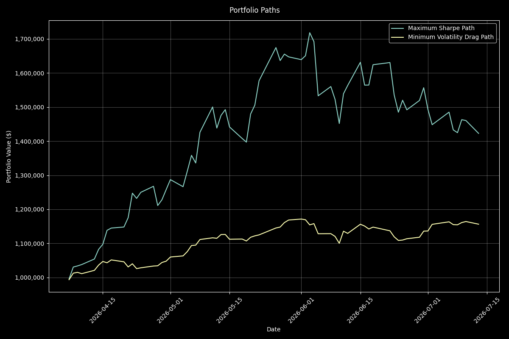
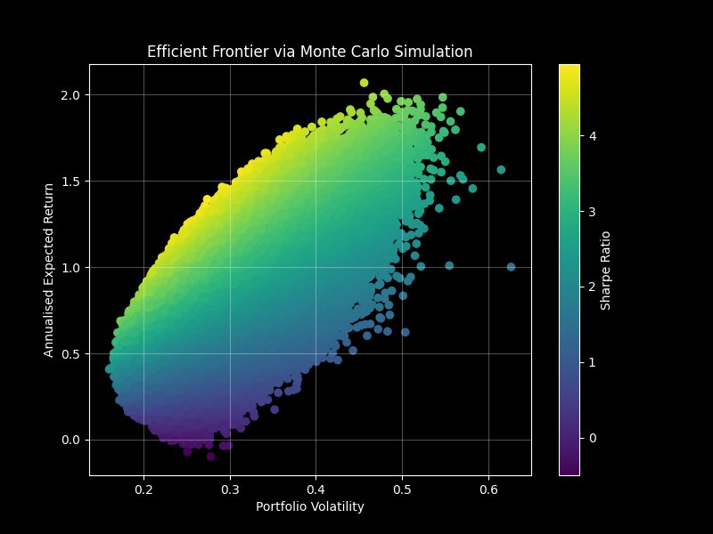
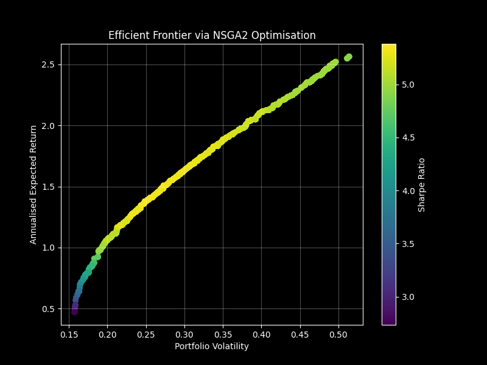
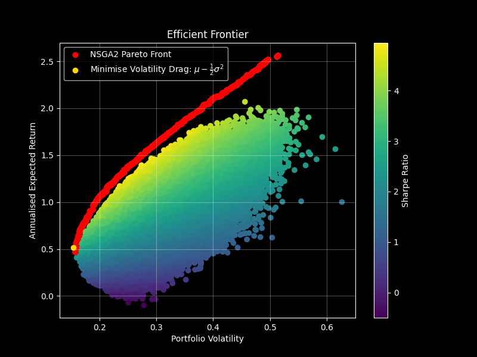
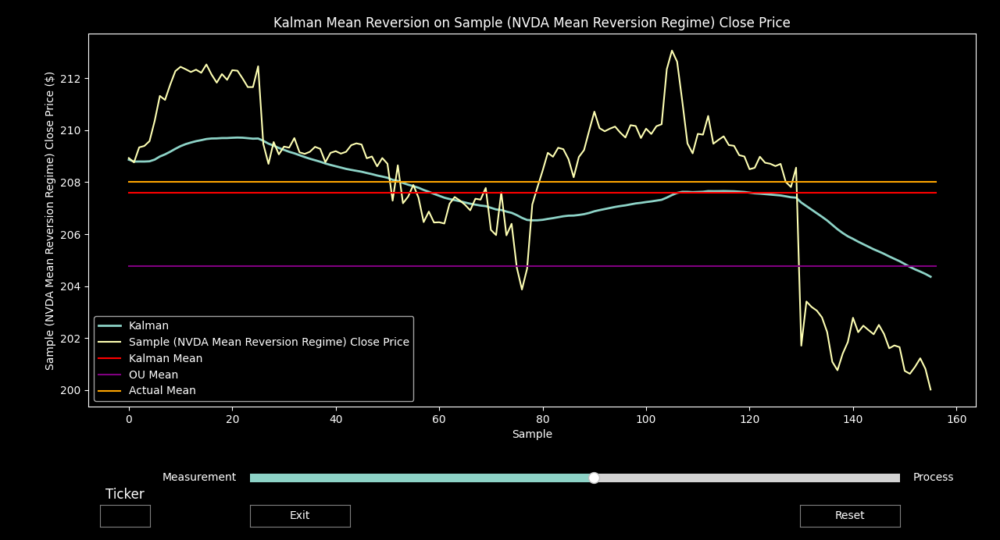
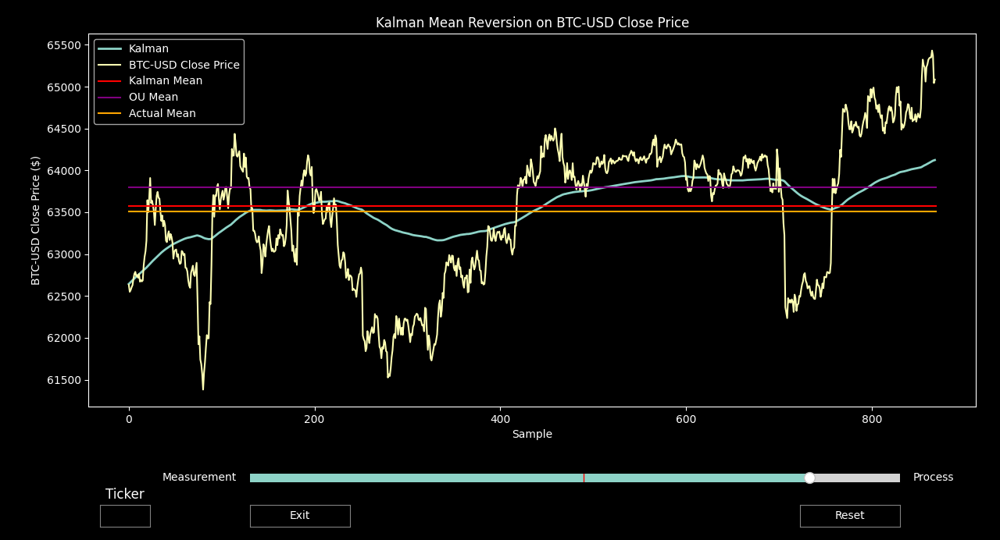

# Portfolio Optimisation

The first portfolio path (various US Equities) follows an asset weighting aimed at maximising the Sharpe ratio:

$$
\text{Sharpe Ratio} = \frac{R_p - R_f}{\sigma_p}
$$

While the second portfolio aims to minimise the effect of volatility drag and therefore maximise compounding returns:

$$
R_g \approx {\mu} - \frac{1}{2}\sigma^2
$$

It can be seen that although in this case the Sharpe ratio maximised portfolio produces higher returns at the end of the period, the volatility drag optimised portfolio produces more consistent returns when faced with risk, leading to a lower drawdown and long term portfolio convexity. 

Below two optimisation methods are presented, one producing the Efficient Frontier via Monte Carlo simulation, and a second method using an evolutionary algorithm (NSGA2) to produce the Pareto front by simultaneously minimising risk, while maximising expected returns as a multi-objective optimisation problem.

# Efficient Frontier via Monte Carlo Simulation

  

# Efficient Frontier via NSGA2 Global Optimisation to find Pareto Front

  

# Point Minimising Volatility Drag

  

# Algorithmic Trading
This strategy combines market data (close price) with a model such as thje Ornstein-Uhlenbeck (OU) process (discretisation displayed below) as a mean-reversion approximation using a linear Kalman Filter. 

$$
X_{k+1} =
\mu
+
(X_k-\mu)e^{-\theta\Delta t}
+
\eta_k
$$

The script "Kalman_Filter_Mean_Reversion" begins by calibrating an OU process to market data, and executing the Kalman Filter algorithm. The results are visualised in an interactive display where the balance between process and measurement uncertainty can be altered. The strategy hopes to produce the Kalman mean line in real time and trade it as a reference.

Examples are displayed below:

  

  

# Future Work
Future work aims to implement this strategy live, pulling data from the Interactive Brokers API and deploying the model in a paper trading capacity.
